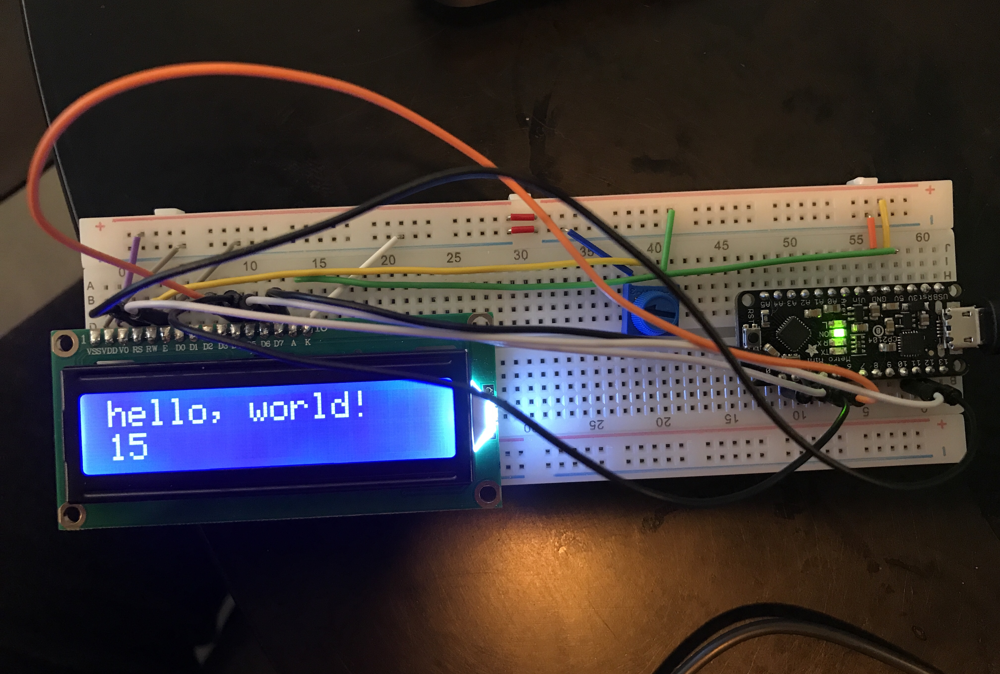
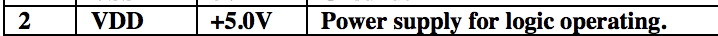
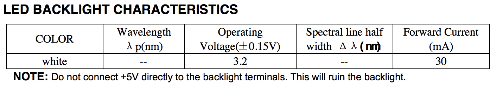

# Make a Digital Timer!
 
## Overview
For this assignment, you are going to 

A) [Solder your LCD panel](#part-a-solder-your-lcd-panel)

B) [Write text to an LCD Panel](#part-b-writing-to-the-lcd) 

c) [Using a time-based digital sensor!](#part-c-using-a-time-based-digital-sensor)

D) [Make your Arduino sing!](#part-d-make-your-arduino-sing)

E) [Make your own timer](#part-e-make-your-own-timer) 
 
## In The Report
Include your responses to the bold questions on your own fork of [this lab report template](https://github.com/FAR-Lab/IDD-Fa18-Lab2). Include snippets of code that explain what you did. Deliverables are due next Tuesday. Post your lab reports as README.md pages on your GitHub, and post a link to that on your main class hub page.

## Part A. Solder your LCD panel

**Take a picture of your soldered panel and add it here!**



## Part B. Writing to the LCD
 
**a. What voltage level do you need to power your display?**

5 volts




**b. What voltage level do you need to power the display backlight?**


   
**c. What was one mistake you made when wiring up the display? How did you fix it?**

the display LCD block was only showing black squares and not letters. The mistake was that I forgot to connect K to ground. Once I did that, the letters showed up!

**d. What line of code do you need to change to make it flash your name instead of "Hello World"?**

Change this:

`lcd.print("Hello, World!");`

To this:

`lcd.print("Natalie!");`

 
**e. Include a copy of your Lowly Multimeter code in your lab write-up.**
```// include the library code:
#include <LiquidCrystal.h>

// initialize the library by associating any needed LCD interface pin
// with the arduino pin number it is connected to
const int rs = 12, en = 11, d4 = 5, d5 = 4, d6 = 3, d7 = 2;
LiquidCrystal lcd(rs, en, d4, d5, d6, d7);


int val = 0;
void setup()
{
 lcd.begin(16, 2);
}

void loop()
{
 val=analogRead(1);
 lcd.clear();
 lcd.print("Multimeter:");
 lcd.setCursor(0,1);
 lcd.print(val);
 delay(500);
}

```

[MyMultimeter Code](./myMultimeter.ino)

## Part C. Using a time-based digital sensor

**Upload a video of your working rotary encoder here.**

[](https://youtu.be/jHAf-oOzHb0)


## Part D. Make your Arduino sing!

**a. How would you change the code to make the song play twice as fast?**

divide this line by 2:

`
int noteDuration = 1000 / noteDurations[thisNote] /2;
`
 
**b. What song is playing?**

Star Wars opening crawl!

## Part E. Make your own timer

**a. Make a short video showing how your timer works, and what happens when time is up!**

[](https://youtu.be/_8XqPYab43A)

**b. Post a link to the completed lab report your class hub GitHub repo.**
